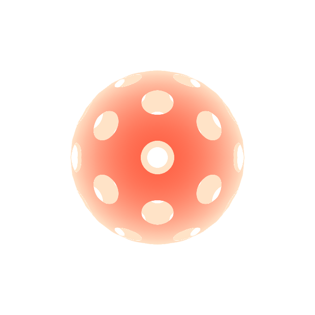

# WebGL Demo

# Run
`npm install`

`npm run dev`

----
new a template

- npx canvas-sketch sketch.js --new --template=three
- read this please ;) notes are taken in this link

https://cookie-tumbleweed-6a4.notion.site/3D-69583836a4f24c058740860ce443a0e2?pvs=4
  # WebGL-Polka-Dot
